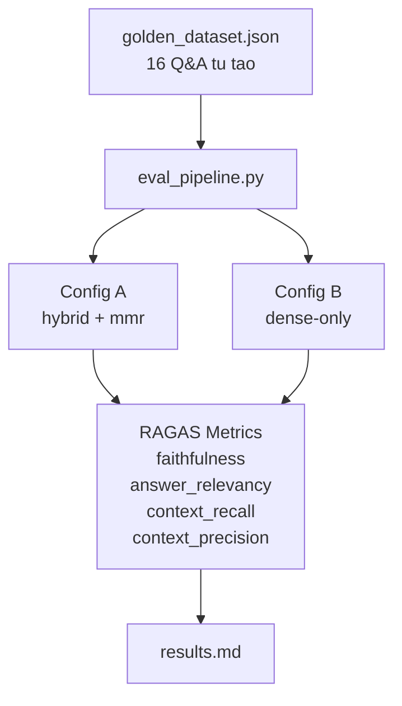

# Group Project - Requirement 2 (RAG Evaluation Pipeline bang RAGAS)

Trien khai nay hoan thanh **Yeu cau 2**:
- Su dung **RAGAS** de evaluate chat luong RAG pipeline
- Co **golden dataset tu tao** voi it nhat 15 cap Q&A
- Chay day du 4 metrics: faithfulness, answer relevancy, context recall, context precision
- So sanh **A/B** giua it nhat 2 cau hinh retrieval
- Xuat bao cao tong hop ket qua va phan tich worst performers

----

## Files chinh

- `group_project/evaluation/golden_dataset.json`: bo QA tu tao
- `group_project/evaluation/eval_pipeline.py`: script chay evaluation bang RAGAS
- `group_project/evaluation/results.md`: bao cao diem so, A/B comparison, phan tich

---

## Framework duoc chon

- Framework: `RAGAS`
- Cac metrics:
  - `faithfulness`
  - `answer_relevancy`
  - `context_recall`
  - `context_precision`

Framework nay duoc chon vi phu hop truc tiep voi bai toan RAG, de so sanh retrieval va generation tren cung mot bo cau hoi chuan.

---

## Golden Dataset tu tao

Bo QA duoc tao thu cong tu chinh tap du lieu cua project:

- Van ban phap luat ve phong, chong ma tuy
- Cac bai bao tin tuc lien quan den nghe si va ma tuy

File:

- `group_project/evaluation/golden_dataset.json`

Bo du lieu hien tai gom **16 cap Q&A tu tao**, moi item co:

- `question`
- `expected_answer`
- `expected_context`

---

## A/B Comparison

Evaluation hien tai so sanh 2 cau hinh:

1. `Config A (hybrid + mmr)`
   - Semantic search + lexical search
   - Reranking bang `MMR`

2. `Config B (dense-only)`
   - Chi dung semantic search
   - Khong reranking

Muc tieu la kiem tra xem hybrid retrieval + reranking co giup tang chat luong retrieval/generation so voi dense-only hay khong.

---

## Cach chay evaluation

Tu thu muc goc cua project:

```bash
pip install -r requirements.txt
python group_project/evaluation/eval_pipeline.py
```

Script se:

1. Load golden dataset tu tao
2. Chay RAG pipeline tren tung cau hoi
3. Tinh 4 metrics bang RAGAS
4. So sanh 2 config A/B
5. Ghi bao cao vao `group_project/evaluation/results.md`

---

## Ghi chu ve pipeline eval

- `eval_pipeline.py` hien tai dung `EvalRAGPipeline` de wrap pipeline truy xuat va generation
- Khi co `OPENAI_API_KEY`, pipeline co the sinh answer bang LLM
- Neu thieu key hoac phat sinh loi khi goi model, pipeline van co fallback answer de quy trinh evaluation khong bi dung giua chung

---

## Kien Truc Requirement 2



---

## Phan Cong Cong Viec

| Thanh vien | MSSV | Nhiem vu | Trang thai |
| --- | --- | --- | --- |
| Trinh Thi Lan Anh | 2A202600737 | Tong hop README nhom va mo ta kien truc Requirement 2 | Done |
| Nguyen Manh Quy | 2A202600643 | Tich hop retrieval pipeline de phuc vu evaluation | Done |
| Nguyen Thanh Anh Quan | 2A202600892 | Chinh generation/retrieval output de dua vao eval pipeline | Done |
| Nguyen Dinh Bao Long | 2A202600981 | Tao golden dataset 15+ cap Q&A va script RAGAS | Done |
| Pham Hoai Nam | 2A202600954 | A/B comparison, results.md va phan tich worst performers | Done |

---

## Deliverables da dat

- [x] `group_project/evaluation/golden_dataset.json` - 15+ cap Q&A
- [x] `group_project/evaluation/eval_pipeline.py` - script chay evaluation
- [x] `group_project/evaluation/results.md` - bang diem va phan tich
- [x] So sanh A/B it nhat 2 configs
