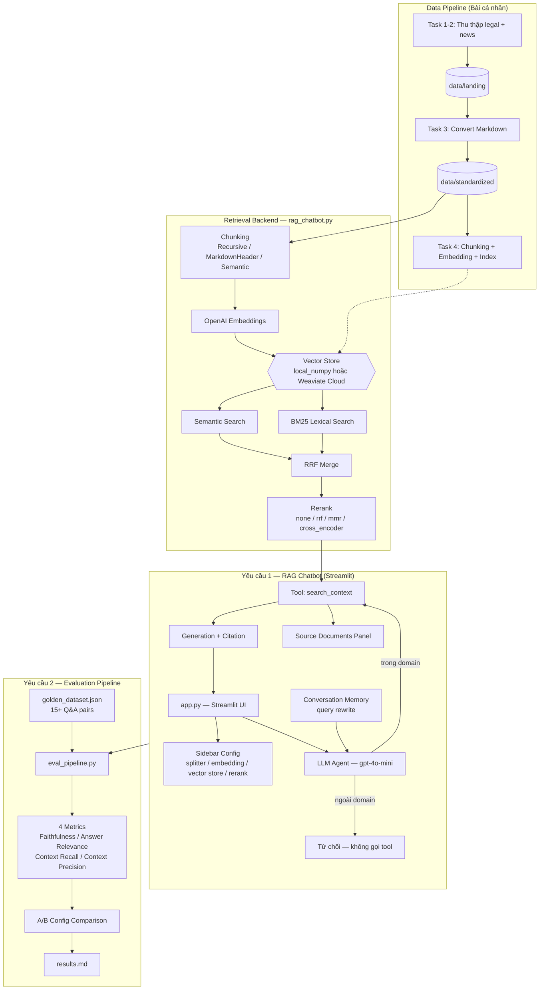

# Group Project — Requirement 1 (RAG Chatbot bằng Streamlit)

Triển khai này hoàn thành **Yêu cầu 1**:
- Streamlit chat UI
- Câu trả lời có citation
- Cho phép chọn splitter / embedding model / reranking
- Cho phép chọn vector store: `local_numpy` hoặc `weaviate_cloud`
- Hỗ trợ follow-up questions với conversation memory
- Hiển thị source documents được dùng khi trả lời

----

## Files chính

- `group_project/app.py`: Streamlit app
- `group_project/rag_chatbot.py`: backend RAG configurable

---

## Điều kiện môi trường

Điền các biến này trong `.env`:

```bash
OPENAI_API_KEY=...
WEAVIATE_URL=https://<cluster>.weaviate.network
WEAVIATE_API_KEY=...
```

Nếu chỉ dùng `local_numpy`, bạn chỉ cần `OPENAI_API_KEY`.

---

## Chạy ứng dụng

Từ thư mục `Lab/Day08-lab-assignment`:

```bash
pip install -r requirements.txt
streamlit run group_project/app.py
```

---

## Cách demo nhanh

1. Mở sidebar, chọn:
   - Splitter
   - Embedding model
   - Reranking method
   - Chunk size / overlap / threshold / top-k
2. Bấm `Build/Rebuild Weaviate index`.
3. Đặt câu hỏi trong chat.
4. Xem:
   - Câu trả lời có citation trong nội dung
   - `Retrieval query` (khi bật conversation memory)
   - Panel `Source documents đã dùng` để kiểm tra evidence

---

## Ghi chú về citation

- Prompt generation bắt buộc mỗi claim có trích dẫn `[source]`.
- Nếu thiếu bằng chứng từ context, chatbot trả về:
  `Tôi không thể xác minh thông tin này từ nguồn hiện có.`

---

## Kiến Trúc Hệ Thống



---

## Phân Công Công Việc

| Thành viên | MSSV | Nhiệm vụ | Trạng thái |
| --- | --- | --- | --- |
| Trịnh Thị Lan Anh | 2A202600737 | **Tích hợp pipeline + Streamlit UI** — `group_project/app.py`: giao diện chat, sidebar config (splitter/embedding/vector store/rerank), build index, hiển thị source panel, chuẩn bị demo | Done |
| Nguyễn Mạnh Quý | 2A202600643 | **Retrieval backend** — `group_project/rag_chatbot.py`: chunking, embedding, index (`local_numpy` / Weaviate), semantic + BM25 hybrid search, reranking | Done |
| Nguyễn Thanh Anh Quân | 2A202600892 | **Agent & Generation** — tool `search_context`, domain gating (chỉ gọi tool khi liên quan dataset), citation, conversation memory / query rewrite | Done |
| Nguyễn Đình Bảo Long | 2A202600981 | **Golden dataset + Eval pipeline** — `evaluation/golden_dataset.json` (≥15 Q&A), `evaluation/eval_pipeline.py` chạy 4 metrics (Faithfulness, Answer Relevance, Context Recall, Context Precision) | Done |
| Phạm Hoài Nam | 2A202600954 | **A/B evaluation + Báo cáo + Docs** — so sánh ≥2 config (vd. có/không rerank), `evaluation/results.md` (worst performers + đề xuất), README kiến trúc + diagram | Done |
